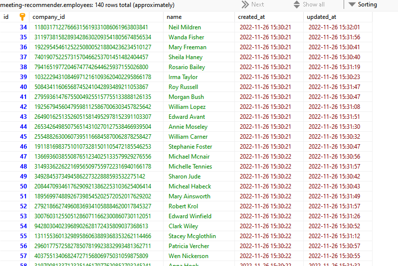

# Buffel & Båg A Meeting Recommender

This Meeting Recommender System follows in line to the requests of Buffel & Båg A to handle its meetings.

The system is to be loaded with the Busy Hours of employees. Then it can accept the following parameters:

1. participants (employee ids), one or multiple
2. desired meeting length (minutes)
3. earliest and latest requested meeting date and time
4. office hours (e.g. 08-17)

## Let's set up the system

1. add the meeting-recommender to appropriate directory
2. cd /meeting-recommender
3. composer install
4. npm install && npm run dev
5. cp .env.example .env
6. php artisan key:generate
7. php artisan migrate:fresh --seed

*Note: For the Development Environment I used ubuntu/bionic64 on Vagrant and used dev.meeting-recommender.local/ as virtual host url. Also I dont think I used sym:link *

## After completed set up:

1. Go to dev.meeting-recomender.local/
2. Login with email: admin@admin.com and password: password
3. You will be greeted with a "Dashboard"
4. Lets upload a Free Busy .txt fileSelect "Status:Active" and "Origin:Manual"". **I will add the get the file from URL ** And hit "Save"
5. A Successful Sync will display the list of uploaded Busy RecordsThe Sync parses through the file and add the Employees to Employees table. And their busy records
6. Lets get the recommended slots via API. I used Postman to access via API: with the following url: .../api/frees For my setup I used the following url: http://dev.meeting-recommender.local/api/frees?employees[]=57646786307395936680161735716561753784&employees[]=259939411636051033617118653993975778241&employees[]=122738134777317151430937745278085616415&employees[]=177736372484123384037491644729334788901&employees[]=176824935157062407093831026130961281174&length=30&start_date_time=2015-01-02 7:00:00&end_date_time=2015-01-02 17:00:00
7. We then get the following results:

{

"0": "2015-01-02T07:00:00.000000Z",

"5": "2015-01-02T09:30:00.000000Z",

"6": "2015-01-02T10:00:00.000000Z",

"8": "2015-01-02T11:00:00.000000Z",

"13": "2015-01-02T13:30:00.000000Z",

"16": "2015-01-02T15:00:00.000000Z",

"19": "2015-01-02T16:30:00.000000Z"
}
